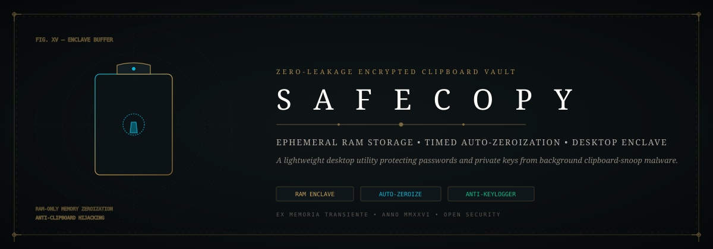

<div align="center">



# 📋 SafeCopy: Zero-Leakage Encrypted Clipboard Vault
### *RAM-Only Ephemeral Storage, Timed Auto-Zeroization & Anti-Clipboard-Snooping Protection*

[](https://github.com/Jaswanth1902/SafeCopy)
[](https://github.com/Jaswanth1902/SafeCopy)
[](https://github.com/Jaswanth1902/SafeCopy)
[](LICENSE)

*A privacy-first desktop utility protecting sensitive tokens, passwords, and cryptocurrency addresses from background clipboard-snoop malware.*

</div>

---

## ⚡ The Architectural Vision

Standard operating systems share a universal plaintext clipboard across all unprivileged applications. Any background process or rogue browser tab can continuously monitor clipboard contents to intercept master passwords, private keys, and API tokens.

**SafeCopy** enforces a zero-trust boundary around the system clipboard:
- **Ephemeral In-Memory Encryption**: Stored entries exist only in volatile RAM encrypted with AES-256-GCM; zero plaintext writes to disk.
- **Automated Memory Zeroization**: Clipboard buffers are cryptographically overwritten and cleared after configurable countdown windows (e.g. 30 seconds).
- **Clipboard Obfuscation**: Injects decoy nonces upon paste execution to blind continuous clipboard pollers.

---

## 🏗️ Clipboard Protection Enclave

```mermaid
flowchart TD
    UserCopy[User Copies Password / Private Token] --> SafeCopyEngine[SafeCopy RAM Enclave]
    
    subgraph CryptographicProtection["Volatile RAM Enclave"]
        SafeCopyEngine --> AESEncrypt[AES-256-GCM In-Memory Encryption]
        AESEncrypt --> CountdownTimer[Configurable Auto-Purge Countdown
(Default: 30 Seconds)]
    end

    CountdownTimer --> PasteTrigger{User Triggers Paste}
    PasteTrigger -->|Within Time Window| PasteDecrypted[Decrypt & Inject via Simulated Keystroke]
    PasteTrigger -->|Countdown Expired| AutoZeroize[Memory Buffer Zeroized with CSPRNG Junk]
    AutoZeroize --> ClearedClipboard[(OS Clipboard Cleared)]
```

---

## 🧩 Antigravity Skills & Tooling

- **`security-linting`**: Zero persistent disk writes for transient secrets.
- **`clean-code`**: Strict memory zeroization protocols (`SecureZeroMemory` / `memset_s`).

---

## 📄 License

Distributed under the [MIT License](LICENSE). Maintained by [Jaswanth Reddy](https://github.com/Jaswanth1902) — *Passionate learner & creative problem solver learning from and giving back to the open-source community.*
